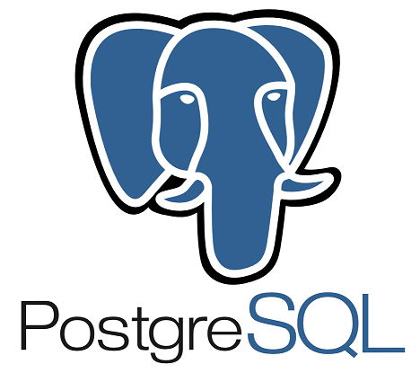

<h1 align="center">foodtosave-case</h1>

<p align="center">
	
	
	
	
	
</p>
<p align="center">
  
</p>

## Sobre este projeto

Este projeto é um caso de teste.

## Pré-requisitos
- [Docker](https://docs.docker.com/install/)
- [Docker Compose](https://docs.docker.com/compose/install/)
- [Golang 1.21.1](https://golang.org/doc/install)

## Passo 1: Clonar o repositório

Comece clonando este repositório para sua máquina local. Abra o terminal e execute o seguinte comando:

```bash
git clone https://github.com/Andreis3/foodtosave-case.git
```

## Passo 2: Instalar dependências

Navegue até o diretório raiz do projeto e execute o seguinte comando para instalar as dependências do Go:

```bash
go mod download
```

## Passo 3: Configurar variáveis de ambiente

O projeto pode exigir algumas variáveis de ambiente para funcionar corretamente. Verifique se existe um arquivo `.env.example` no diretório raiz do projeto. Se existir, faça uma cópia desse arquivo e renomeie-o para `.env`. Em seguida, atualize as variáveis de ambiente de acordo com as configurações do seu ambiente local.


## Passo 4: Subir o ambiente

Para iniciar os serviços, execute o seguinte comando:

```bash
make docker-up ou docker-compose up -d --build
```

## Passo 5: Executar o projeto

Para executar o projeto, execute o seguinte comando: \
Obs: precisa ter golang instalado na máquina versão minima 1.21.1

```bash
make run-app
```

## Passo 6: Testar o projeto
Objeto valido:

```bash
curl --location --request POST 'http://localhost:8080/v1/author' \
--header 'Content-Type: application/json' \
--data-raw '{
    "name": "teste 1",
    "nationality": "test 1",
    "books": [
        {
            "title": "test 1",
            "gender": "test 1"
        },
        {
            "title": "test 1",
            "gender": "test 1"
        }
    ]
}'
```
Objeto invalido

```bash
{
    curl --location --request POST 'http://localhost:8080/v1/author' \
--header 'Content-Type: application/json' \
--data-raw '{
    "name": "",
    "nationality": "",
    "books": [
        {
            "title": "",
            "gender": ""
        },
        {
            "title": "",
            "gender": ""
        }
    ]
}'
}
```


## Passo 7: Executar os testes

Para executar os testes, execute o seguinte comando:

```bash
make unit-tests
```
OBS: A aplicação precisa estar rodando para executar os testes de integração
```bash
make integration-tests
```

## Passo 8: Gerar nova tag de versão

Para gerar uma nova tag de versão, execute o seguinte comando e siga as instruções que aparecerão no terminal:

```bash
make tag
```

### Layout

```tree
.
├── docs/
│   ├── dashboards
│   └── sql
├── cmd/
│   └── author
├── configs
├── internal/
│   ├── app/
│   │   ├── command
│   │   └── query
│   ├── domain/
│   │   ├── aggregate
│   │   ├── entity      
│   │   ├── usecase
│   │   ├── errors
│   │   ├── cache
│   │   ├── observability
│   │   ├── repository
│   │   └── uow
│   ├── infra/
│   │   ├── adapters/
│   │   │   └── db/
│   │   │       ├── postgres
│   │   │       └── redis
│   │   ├── common/
│   │   │   ├── config
│   │   │   ├── logger
│   │   │   ├── observability
│   │   │   └── uuid
│   │   ├── factory/
│   │   │   ├── command
│   │   │   ├── handler
│   │   │   └── query
│   │   ├── mapper
│   │   ├── repository/
│   │   │   ├── postgres/
│   │   │   │   ├── author
│   │   │   │   └── book
│   │   │   └── redis/
│   │   │       └── cache
│   │   ├── routes
│   │   ├── server
│   │   ├── setup
│   │   └── uow
│   ├── presentation/
│   │   └── http/
│   │       ├── handlers/
│   │       │   ├── authorhandler/
│   │       │   │   ├── authorroutes
│   │       │   │   └── dto
│   │       │   ├── healthcheck/
│   │       │   │   ├── healthhandler
│   │       │   │   └── healthroutes
│   │       │   └── observability/
│   │       │       └── metricsroutes
│   │       ├── helpers
│   │       └── middlewares
│   └── util
└── tests/
    ├── mock
    ├── unit
    └── integration
```


> ## Importante
> * O projeto implementa o padrão de projeto [Unit of Work](https://martinfowler.com/eaaCatalog/unitOfWork.html#:~:text=A%20Unit%20of%20Work%20keeps,a%20result%20of%20your%20work.) (UOW) para garantir que todas as operações de banco de dados sejam executadas com sucesso ou sejam desfeitas em caso de erro.
